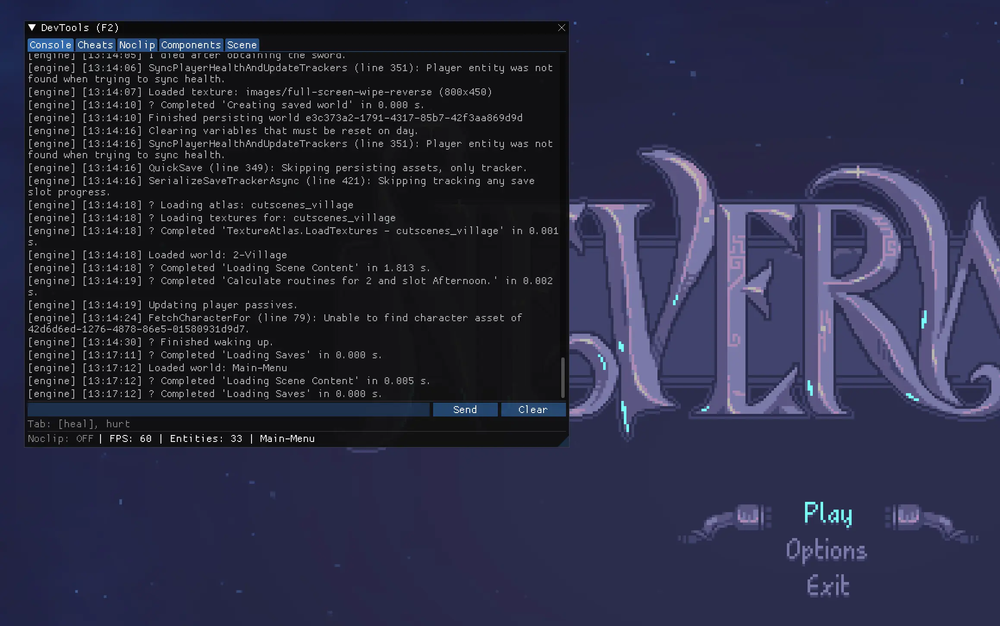

# Neverway DevTools



Developer tools mod for [Neverway](https://store.steampowered.com/app/2318330/Neverway/), built with [murder-mod-loader](https://github.com/yuna0x0/murder-mod-loader).

Press **F2** to toggle the overlay. Press **F3** to toggle noclip.

## Features

### Command Console
- Execute all Murder Engine console commands
- Command autocomplete with Tab cycling
- Command history with Up/Down arrows
- `help` to list all commands, `help <command>` for details
- Engine log forwarding (Murder's `GameLogger` messages appear in the console)
- Auto-scroll when at bottom, pauses when browsing history
- Crash-safe: invalid commands show errors instead of crashing

### Cheats
- **Health & Combat**: Godmode, kill all, heal, hurt, suicide
- **Economy**: Money, gems, mortgage
- **Time**: Time slider, skip, end day, pause, set day
- **Stamina**: Slider (base max 6 + modifiers)
- **Inventory**: Debug inventory, sword, learn all recipes
- **Levels**: Set all trace levels
- **NPCs**: Meet/know all, per-NPC actions, quest progress
- **Blackboard**: List and set gameplay variables
- **Environment**: Rain, glitch shader, noise shader, grow plants
- **Barduc**: Win/lose/draw minigame
- **Misc**: Quick save

### Noclip
- Toggle with F3 (works even when overlay is hidden)
- WASD/Arrow keys to move, Shift for 3x speed
- Free camera mode (camera independent of player)
- Teleport to coordinates
- Reset to saved position
- Auto-disables on scene change

### Component Viewer/Editor
- Browse all entities with search and component filter
- Entity names resolved via `PrefabRefComponent`
- Inspect all components and their fields
- Edit field values at runtime (int, float, bool, string, Vector2, enum)
- Add/remove components on entities

### Scene Switcher
- View current scene and world info
- Browse all available worlds with search
- Switch scenes by clicking

## Requirements

- [Neverway](https://store.steampowered.com/app/2318330/Neverway/)
- .NET 8 SDK
- [murder-unpack](https://github.com/yuna0x0/murder-unpack) (`uv tool install murder-unpack`)
- [murder-mod-install](https://github.com/yuna0x0/murder-mod-loader) (`dotnet tool install -g murder-mod-install`)

## Quick Start

```bash
# Install prerequisites
uv tool install murder-unpack
dotnet tool install -g murder-mod-install

# Install mod loader into the game
murder-mod-install "/path/to/Neverway"

# Clone and build this mod
git clone https://github.com/yuna0x0/neverway-devtools.git
cd neverway-devtools
murder-mod-install build . "/path/to/Neverway"

# Launch
"/path/to/Neverway/launch-modded.sh"    # macOS / Linux
"/path/to/Neverway/launch-modded.bat"   # Windows
```

## Building from Source

```sh
dotnet build -p:GameAssemblyPath="/path/to/Neverway/.modded"
```

## Manual Installation

Copy to the game's mods directory:

```
<game-dir>/mods/devtools/
  mod.yaml
  NeverwayMod.DevTools.dll
  ImGui.NET.dll
  libcimgui.dylib    (macOS)
  cimgui.dll         (Windows)
  libcimgui.so       (Linux)
```

## Controls

| Key | Action |
|-----|--------|
| F2 | Toggle DevTools overlay |
| F3 | Toggle noclip |
| WASD / Arrows | Noclip movement |
| Shift | Noclip speed boost (3x) |
| Tab | Cycle console autocomplete |
| Up/Down | Console command history |
| Enter | Execute command |

## Roadmap

- [ ] C# expression evaluator (REPL)
- [ ] System viewer (list/toggle active ECS systems)
- [ ] Keyboard input suppression when typing in console

## AI Disclosure

AI was used to assist in the creation of some of this tool's base code.

## License

[MIT](LICENSE)
